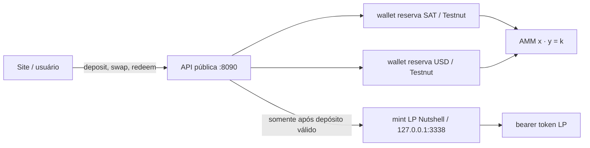

# Cashu AMM — especificação da PoC

Status: implementada e validada localmente com tokens Testnut reais.

## 1. Objetivo

Demonstrar uma pool SAT/USD em Cashu com duas interfaces sobre as mesmas
reservas:

```text
liquidez: SAT + USD → LP → SAT + USD pro rata
trade:     SAT ⇄ USD pela curva x × y = k
```

O operador é custodiante e controla a pool, as wallets de reserva e a mint LP.
Isso é deliberado para a demo; não é uma DEX trustless.

## 2. Arquitetura mínima

Um container executa dois processos:



A mint LP é uma autoridade Cashu privada pertencente à pool. LP é um TokenV4
Cashu como SAT e USD: tem keyset, blind signature, proofs e proteção contra
double-spend. O que muda é o ativo subjacente. Um LP representa uma fração de
dois outros ativos Cashu — as reservas SAT e USD expostas pelo AMM — e não uma
reserva Lightning própria.

A mint não guarda uma terceira reserva econômica: apenas assina a quantidade de
shares calculada pela pool. Para isso, o backend de pagamento da mint LP é o
`FakeWallet` do Nutshell e auto-liquida quotes internas. Esse é o único mock do
runtime; os tokens, as assinaturas LP e os dois ativos de reserva são reais em
testnet.

Reutilizamos o Nutshell para keysets, blind signatures, DLEQ, proof state e
proteção contra double-spend. A aplicação implementa somente a contabilidade
SAT/USD/LP e a curva do AMM.

## 3. Ativos e estado

- SAT: unidade inteira `sat` da Testnut.
- USD: menor unidade inteira `usd` da Testnut, tratada como centavo na UI.
- LP: unidade fungível da mint privada da pool.
- Fee do AMM: `100 bps`, ou 1%.

O estado autoritativo é:

```text
reserve_sat, reserve_usd, total_lp
```

A pool começa vazia. O primeiro depósito define as reservas, o preço e o supply
inicial:

```text
total_lp = floor(sqrt(deposit_sat × deposit_usd))
```

Não existe seed LP nem inventário pré-mintado.

## 4. Liquidez

### Primeiro depósito

Depois de receber os dois TokenV4, a pool calcula a raiz geométrica, solicita a
emissão exata à mint LP privada e devolve o TokenV4 LP. Se a emissão falhar, os
dois ativos são devolvidos quando a compensação é possível.

### Depósitos seguintes

Para reservas `R_sat`, `R_usd`, supply `S` e valores recebidos `D_sat`, `D_usd`:

```text
shares_sat = floor(D_sat × S / R_sat)
shares_usd = floor(D_usd × S / R_usd)
shares     = min(shares_sat, shares_usd)
```

O depósito deve seguir a proporção atual. A PoC aceita desvio de até 1% para
absorver fees de input Cashu; acima disso, devolve os dois tokens. Quantidades e
shares sempre arredondam em favor da pool.

### Resgate

Para `L` shares:

```text
amount_sat = floor(R_sat × L / S)
amount_usd = floor(R_usd × L / S)
```

O valor de uma posição LP é, portanto, sua fração atual dos dois ativos — não um
preço fixo de LP. Fees acumuladas e mudanças na composição da pool aparecem no
resgate pro rata.

A API da pool recebe o TokenV4 LP, prepara os dois outputs, invalida as proofs LP
e só então responde com SAT e USD. Esse endpoint é o melt econômico do LP, mas
não usa NUT-05: um melt Cashu convencional paga um único payment request e não
tem um formato para devolver dois TokenV4 de mints/unidades diferentes.

Ao receber o LP, o Nutshell já gasta as proofs originais do usuário e cria
proofs de substituição na wallet da pool. `invalidate()` elimina essas proofs de
substituição localmente. Isso basta para impedir reuso normal nesta PoC privada,
mas não constitui um burn protocolar verificável nem prova, sozinho, a redução
das liabilities da mint. A autoridade econômica continua sendo o estado
`total_lp` da aplicação. Resgates que arredondariam um dos ativos para zero são
recusados e o LP é devolvido.

## 5. AMM

Para input exato `a`, reserva de entrada `x`, reserva de saída `y` e
`BPS = 10.000`:

```text
effective  = a × (BPS - 100)
amount_out = floor(effective × y / (x × BPS + effective))
```

Depois do swap:

```text
reserve_in  = reserve_in + amount_in
reserve_out = reserve_out - amount_out
```

O 1% não vai para uma conta separada: permanece nas reservas. O swap falha se a
pool estiver vazia, o input for inválido, o output arredondar para zero ou não
houver liquidez suficiente.

O preço exibido é:

```text
usd_per_btc = reserve_usd × 1.000.000 / reserve_sat
```

Não há oracle: o preço nasce exclusivamente da razão entre as reservas.

## 6. Cashu e fees da mint

Entradas e saídas são TokenV4 reais. Ao receber um token, o backend mede a
variação do saldo spendable da wallet e contabiliza esse valor líquido. Isso
mantém o snapshot compatível com as fees de input cobradas pela Testnut.

A fee Cashu não é a fee do AMM:

- fee Cashu: custo da mint para receber proofs;
- fee AMM: 1% aplicado pela fórmula de swap e retido pela pool.

Quotes pagas são idempotentes: repetir `POST /api/mint` com o mesmo `quote_id`
devolve o mesmo bearer token, sem emitir valor novamente. Depósito, swap e
resgate exigem um `operation_id` UUID gerado pelo cliente. Os outputs econômicos
são persistidos antes do journal ser concluído; repetir o mesmo ID e payload
devolve exatamente os mesmos bearer tokens sem alterar as reservas outra vez.
Reusar o ID com outro payload é recusado.

## 7. Falhas e persistência

As mutações usam um lock único, snapshot gravado por rename atômico e journal
durável.

- input rejeitado encerra o journal sem bloquear restart;
- falha antes de entregar outputs tenta devolver os ativos recebidos;
- no resgate, outputs preparados são cancelados no Nutshell antes de devolver o
  LP;
- se um output não puder ser cancelado, o LP não é devolvido e a operação fica
  pendente para impedir crédito duplicado;
- uma operação pendente bloqueia a inicialização para reconciliação manual do
  operador.
- se a resposta HTTP se perder depois do commit, o cliente repete o mesmo
  `operation_id` e recupera os bearer tokens persistidos.

Não existe atomicidade distribuída perfeita entre mints independentes. Para a
PoC, preparar, cancelar e bloquear em caso ambíguo é a fronteira correta.

## 8. HTTP e interface

- `GET /api/pool`: reservas, preço, `k`, fee, supply LP e eventos;
- `POST /api/mint/quote`: cria quote SAT ou USD;
- `POST /api/mint`: emite o TokenV4 de uma quote paga;
- `POST /api/liquidity/deposit`: recebe `{operation_id, sat_token, usd_token}` e
  devolve LP;
- `POST /api/swap`: recebe `{operation_id, direction, token}` e devolve o outro
  ativo;
- `POST /api/liquidity/redeem`: recebe `{operation_id, lp_token}` e devolve SAT
  + USD;
- `GET /health`: liveness do backend.

O mesmo servidor entrega `index.html`, JavaScript, CSS e API. Não há deploy em
GitHub Pages nem dependência de `localhost` em um site público.

## 9. Aceitação da demo

A implementação é aceita quando:

1. um único `docker compose up --build` inicia site, API e mint LP;
2. o primeiro depósito SAT/USD Testnut emite LP real;
3. swaps SAT→USD e USD→SAT alteram as mesmas reservas;
4. o resgate do LP devolve os dois ativos pro rata;
5. a fee é 1% e os arredondamentos favorecem a pool;
6. restart preserva wallets, mint LP e snapshot no volume;
7. nenhum bearer token é fabricado no navegador.

O script `scripts/smoke-local.py` executa os itens 2–4 e também testa retry de
mint, depósito, ambos os swaps e resgate sem imprimir os tokens. O comando
`npm run test:e2e` repete o circuito inteiro pela interface em Chrome headless.

## 10. Fora do escopo

- fundos reais e solvência garantida;
- operação trustless, federação ou governança;
- HTLC, Nostr, oracle e roteamento entre pools;
- depósitos single-sided, StableSwap, weighted ou concentrated liquidity;
- recuperação automática de toda falha possível;
- segurança e operação de produção.
- slippage protection (`minimum_amount_out`), acompanhada na
  [issue #1](https://github.com/brenorb/cashu-amm/issues/1).
